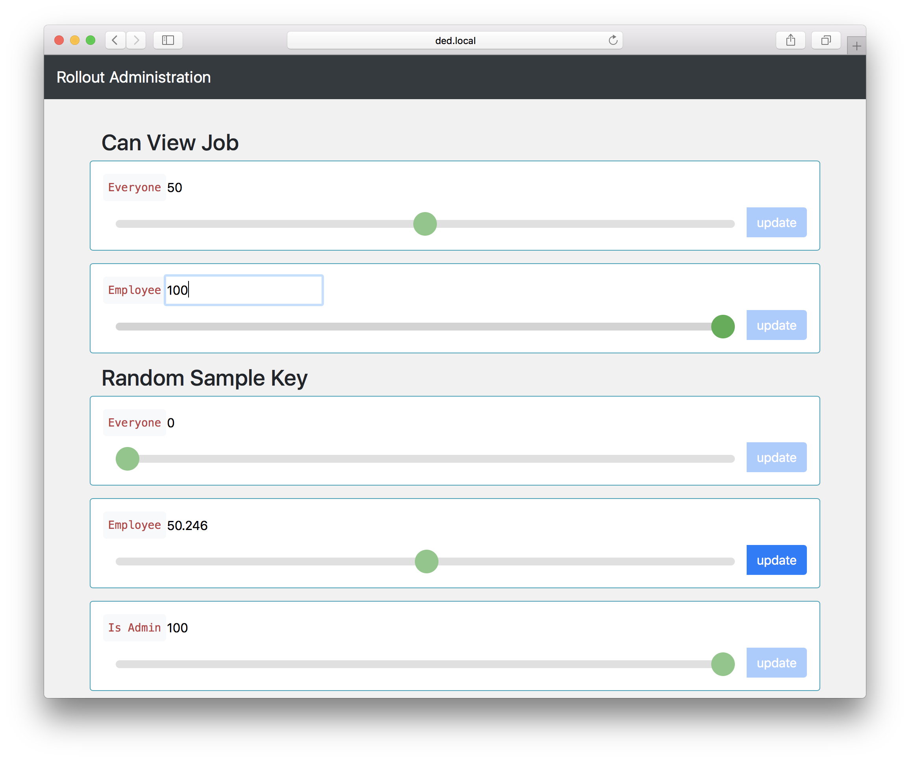

## Rollout UI
an administration interface built for the `[node-rollout](https://github.com/mix/node-rollout)` module.

```sh
npm i rollout-ui --save
```

Mount the `rollout-ui` Express sub-router to your existing application.

```js
// obtain an instance of your rollouts
let redis = require('redis').createClient()
let rollout = require('node-rollout')(redis)

// include rollout-ui with your rollout instance
app.use('/admin/rollout', require('rollout-ui').client(rollout))

// consider a layer of authentication
let basicAuth = require('express-basic-auth')
app.use('/admin/rollout', basicAuth({{ users: { 'admin': 'secret' }}}), require('rollout-ui').client(rollout))
```

Visit your custom route: In the above scenario: `example.com/admin/rollout`
It looks like this:



